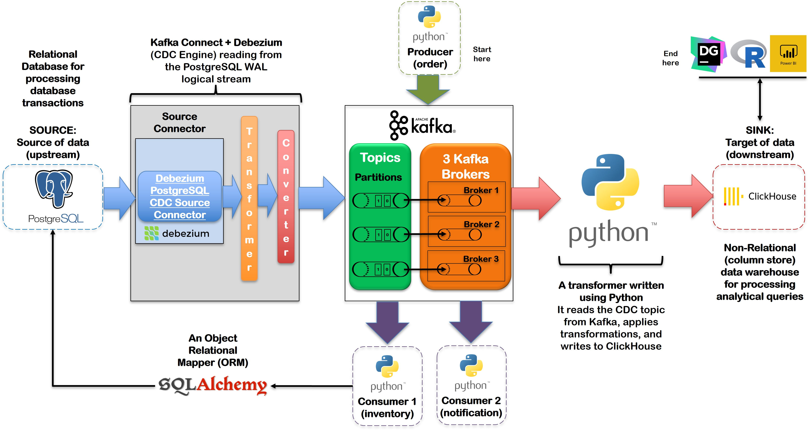
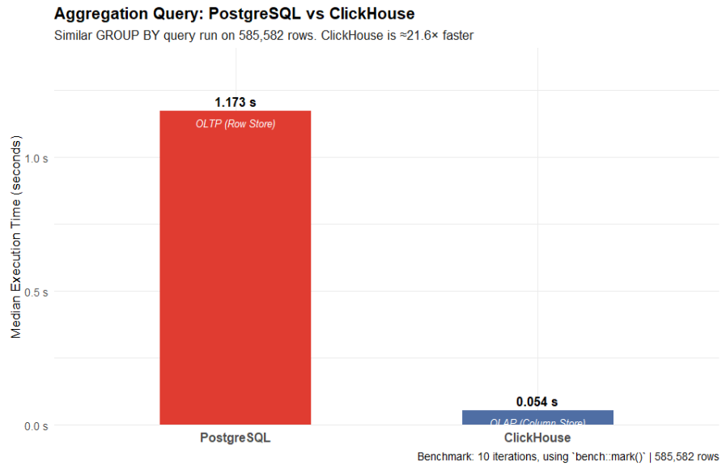

[](https://classroom.github.com/a/hpibNz8-)
# Kafka

| Key             | Value                                                                                                                                                                                                                                                                           |
|:----------------|:--------------------------------------------------------------------------------------------------------------------------------------------------------------------------------------------------------------------------------------------------------------------------------|
| **Course Code** | BBT 4106                                                                                                                                                                                                                                                                        |
| **Course Name** | BBT 4106: Business Intelligence I (Week 4-6)                                                                                                                                                                                                                                    |
| **Semester**    | April to July 2026                                                                                                                                                                                                                                                              |
| **Lecturer**    | Allan Omondi                                                                                                                                                                                                                                                                    |
| **Contact**     | aomondi@strathmore.edu                                                                                                                                                                                                                                                          |
| **Note**        | The lecture contains both theory and practice.<br/>This notebook forms part of the practice.<br/>It is intended for educational purposes only.<br/>Recommended citation: [BibTex](https://raw.githubusercontent.com/course-files/Kafka/refs/heads/main/RecommendedCitation.bib) |

## Technology Stack

<p align="left">


 
</p>


## System Architecture



## Expected Results

A data warehouse designed using a non-relational data model (ClickHouse)
enables analytical queries that a database designed using a relational
(object relational) data model (PostgreSQL) cannot serve at scale.

This justifies the need to create a data pipeline that separates the
ACID-compliant processing of database transactions from the processing of
analytical queries.



## Repository Structure
```text
.
├── 0_admin_instructions
│   ├── 0_instructions_for_project_setup.md
│   ├── 1_instructions_for_python_installation.md
│   └── 2_instructions_for_project_cleanup.md
├── 1_kafka_fundamentals                    ← This is Part 1 of the lab.
│   ├── consumer_order_inventory.py
│   ├── consumer_order_notification.py
│   ├── docker-compose.yaml
│   ├── instructions_for_project_setup.md
│   ├── instructions_for_running_unit_tests.md
│   ├── producer_order.py
│   ├── project_cleanup.sh
│   ├── project_setup.sh
│   ├── requirements.txt
│   ├── test_consumer_order_inventory.py
│   ├── test_consumer_order_notification.py
│   └── test_producer_order.py
├── 2_containerized_microservices           ← This is Part 2 of the lab.
│   ├── consumer-inventory
│   │   ├── Dockerfile.consumer-inventory
│   │   ├── consumer_order_inventory.py
│   │   ├── models.py
│   │   ├── requirements.txt
│   │   └── test_consumer_order_inventory.py
│   ├── consumer-notification
│   │   ├── Dockerfile.consumer-notification
│   │   ├── consumer_order_notification.py
│   │   ├── requirements.txt
│   │   └── test_consumer_order_notification.py
│   ├── database
│   │   └── init.sql
│   ├── docker-compose.yaml
│   ├── instructions_for_project_setup.md
│   ├── producer
│   │   ├── Dockerfile.producer
│   │   ├── producer_order.py
│   │   ├── requirements.txt
│   │   └── test_producer_order.py
│   ├── project_cleanup.sh
│   └── project_setup.sh
├── 3_data_engineering                      ← This is Part 3 of the lab.
│   ├── clickhouse
│   │   ├── config.d
│   │   │   └── timezone.xml
│   │   └── init.sql
│   ├── consumer-inventory
│   │   ├── Dockerfile.consumer-inventory
│   │   ├── consumer_order_inventory.py
│   │   ├── models.py
│   │   ├── requirements.txt
│   │   └── test_consumer_order_inventory.py
│   ├── consumer-notification
│   │   ├── Dockerfile.consumer-notification
│   │   ├── consumer_order_notification.py
│   │   ├── requirements.txt
│   │   └── test_consumer_order_notification.py
│   ├── database
│   │   └── init.sql
│   ├── docker-compose.yaml
│   ├── instructions_for_project_setup.md
│   ├── kafka-connect
│   │   ├── connector-config.json
│   │   ├── connector-config.json_documented_version.md
│   │   └── register-connector.sh
│   ├── producer
│   │   ├── Dockerfile.producer
│   │   ├── producer_order.py
│   │   ├── requirements.txt
│   │   └── test_producer_order.py
│   ├── project_cleanup.sh
│   ├── project_setup.sh
│   └── transformer
│       ├── Dockerfile.transformer
│       ├── requirements.txt
│       └── transformer.py
├── 4_data_analytics                        ← This is Part 4 of the lab.
│   ├── connect_clickhouse_with_ODBC.R
│   ├── generate_data.py
│   ├── instructions_for_project_setup.md
│   ├── lab4_analytics_with_odbc_quarto.docx
│   ├── lab4_analytics_with_odbc_quarto.html
│   └── lab4_analytics_with_odbc_quarto.qmd
├── Kafka.Rproj
├── LICENSE
├── README.md                               ← This is the file you are reading.
├── RecommendedCitation.bib
├── assets
│   └── images
│       ├── DataGrip_Output.png
│       ├── ExpectedResults.png
│       ├── PBI_to_CH_1.png
│       ├── PBI_to_CH_10.png
│       ├── PBI_to_CH_11.png
│       ├── PBI_to_CH_2.png
│       ├── PBI_to_CH_3.png
│       ├── PBI_to_CH_4.png
│       ├── PBI_to_CH_5.png
│       ├── PBI_to_CH_6.png
│       ├── PBI_to_CH_7.png
│       ├── PBI_to_CH_8.png
│       ├── PBI_to_CH_9.png
│       ├── SystemArchitecture.jpg
│       ├── SystemArchitecture.png
│       └── TheUntoldStoryofR.png
├── lab_submission_instructions.md
├── project_cleanup.sh
└── requirements
    ├── base.txt
    ├── colab.txt
    ├── constraints.txt
    ├── dev.inferred.txt
    ├── dev.lock.txt
    ├── dev.txt
    └── prod.txt

21 directories, 94 files
```

## Setup Instructions

- [Setup Instructions](0_admin_instructions/0_instructions_for_project_setup.md)

## Lab Manual

Refer to the files below, in the order specified, for more details:

1. [Part 1: Kafka Fundamentals](1_kafka_fundamentals/instructions_for_project_setup.md)
2. [Part 2: Containerized Microservices](2_containerized_microservices/instructions_for_project_setup.md)
3. [Part 3: Data Engineering using Kafka](3_data_engineering/instructions_for_project_setup.md)
4. [Part 4: Data Analytics using R and ClickHouse](4_data_analytics/instructions_for_project_setup.md)

## Lab Submission Instructions

- [Lab Submission Instructions](lab_submission_instructions.md)

## Cleanup Instructions (to be done after submitting the lab)

- [Cleanup Instructions](0_admin_instructions/2_instructions_for_project_cleanup.md)
