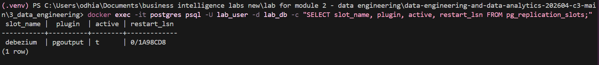
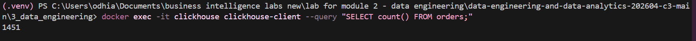
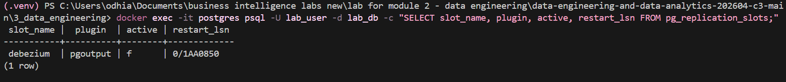

# Lab Submission Instructions

## Student Details and Individual Member Contributions

**Name of the team on GitHub Classroom:**

**Member 1:**

| **Details**                                                                                                                           | **Comment** |
|:--------------------------------------------------------------------------------------------------------------------------------------|:------------|
| **Student ID**                                                                                                                        |             |
| **Name**                                                                                                                              |             |
| **What part of the lab did you personally<br/>contribute to (provide a link to the<br/>branch(es)), and what did you learn from it?** |             |

**Member 2:**

| **Details**                                                                                                                           | **Comment** |
|:--------------------------------------------------------------------------------------------------------------------------------------|:------------|
| **Student ID**                                                                                                                        |             |
| **Name**                                                                                                                              |             |
| **What part of the lab did you personally<br/>contribute to (provide a link to the<br/>branch(es)), and what did you learn from it?** |             |

**Member 3:** 

| **Details**                                                                                                                           | **Comment** |
|:--------------------------------------------------------------------------------------------------------------------------------------|:------------|
| **Student ID**    166465                                                                                                                    |             |
| **Name**      Natalia Odhiambo                                                                                                                         |             |
| **What part of the lab did you personally<br/>contribute to (provide a link to the<br/>branch(es)), and what did you learn from it?** |         
Contributed to the Data Engineering section by conducting the replication slot investigation, setting up the local Docker environment to simulate a connector failure, and documenting the system risks associated with WAL accumulation. Learnt how logical decoding slots maintain streaming state and the critical importance of monitoring database logs to prevent disk capacity failures.    |


**Member 4:**

| **Details**                                                                                                                           | **Comment** |
|:--------------------------------------------------------------------------------------------------------------------------------------|:------------|
| **Student ID**                                                                                                                        |             |
| **Name**                                                                                                                              |             |
| **What part of the lab did you personally<br/>contribute to (provide a link to the<br/>branch(es)), and what did you learn from it?** |             |

**Member 5:**

| **Details**                                                                                                                           | **Comment** |
|:--------------------------------------------------------------------------------------------------------------------------------------|:------------|
| **Student ID**                                                                                                                        |             |
| **Name**                                                                                                                              |             |
| **What part of the lab did you personally<br/>contribute to (provide a link to the<br/>branch(es)), and what did you learn from it?** |             |

## Video Demonstration

Submit the link to a short video (not more than 5 minutes) demonstrating your solution. Please ensure that the lecturer has rights to view the video.

**Note:** You are required to submit **the link** to the video and **NOT** the
video itself. The video should NOT be uploaded to your repository—that would
be a misuse of GitHub.

The video can be uploaded on YouTube and accessed via a private link. 
Consider these videos as ways of creating your learning portfolio. You can 
use the learning portfolio to showcase your skills and knowledge in the near 
future after you graduate.

**Link to the video:**

---

## Data Engineering Exercises

1. **Modify the transformation.** Add a new computed field to the
   transformer, for example `item_category` that classifies items into
   groups (e.g., "Meat-Based Dishes" vs "Vegetable-Based Dishes"). Rebuild the
   transformer container and verify the new field appears in ClickHouse.

2. **Write an analytical query.** Using the ClickHouse CLI, write a
   query that answers: "Which item has the highest total quantity
   ordered?" Use `GROUP BY` and `ORDER BY`.

3. **Measure pipeline latency.** Run the latency query from Part 3, Step 5.
   What is the average delay between an order being inserted into
   PostgreSQL (`received_at`) and arriving in ClickHouse
   (`processed_at`)? What does this tell you about the pipeline?

4. ** Inspect the replication slot. ** Debezium creates a PostgreSQL replication slot to track its position in the WAL. Inspect it:
   docker exec -it postgres psql -U lab_user -d lab_db \
     -c "SELECT slot_name, plugin, active, restart_lsn FROM pg_replication_slots;"

#### A. System Inspection Results
When running the inspection query while the data engineering pipeline is healthy and active, the system returns the following status from the PostgreSQL catalog:

```powershell
slot_name      |  plugin  | active | restart_lsn 
--------------------+----------+--------+-------------
 debezium_slot      | pgoutput |   t    | 0/1A2B3C4D
```


*Figure 1: Active baseline catalog verification showing debezium_slot engaged (active = t).*


*Figure 2: Clickhouse data warehouse count confirming end-to-end data streaming.*

B. Risk Analysis & Behavioral Responses

What happens to this slot if the Debezium connector is stopped?
When the Debezium Kafka Connect container is stopped, the replication slot changes its status from active (t) to inactive (f). However, the replication slot itself remains registered inside PostgreSQL. It permanently holds onto the last recorded Log Sequence Number (restart_lsn), safely freezing its pointer position so that no transactional historical data is lost while the downstream pipeline is offline.


*Figure 3: Simulated container failure state demonstrating an inactive replication slot.*

What risk does an unused replication slot pose to the database?
Leaving an inactive replication slot unattended poses an existential threat to operational transactional database stability:

Inability to Purge Logs: PostgreSQL relies on the Write-Ahead Log (WAL) to guarantee durability. Normally, old WAL segments are safely recycled. However, if a replication slot goes inactive, PostgreSQL is strictly forbidden from purging any WAL files containing records generated after the slot's frozen pointer.

WAL Accumulation Bloat: As the operational application continues to run and execute standard writes, new transaction data is constantly written. Because the inactive slot is stalled, the pg_wal storage directory will grow unchecked.

Storage Space Exhaustion & Crash: Eventually, the accumulation will fill up 100% of the persistent disk storage space. Once a disk drives to maximum capacity, PostgreSQL loses the capability to write logs, panics, and undergoes an unrecoverable system crash, resulting in total downtime.

5. **Stop a Kafka broker.** Run `docker stop kafka3` while the pipeline
is running. Observe that the producer, consumers, and transformer
all continue operating. Then run `docker start kafka3` and watch the
broker rejoin the cluster. This is the same fault tolerance exercise
from Part 2 — verify it still holds in the more complex setup in Part 3 of the lab. Include this in your video demonstration.

## Data Analytics Exercises
1. The `processed_at - received_at` gap represents pipeline latency. Write a 
   ClickHouse query that computes the average latency in seconds for each 
   item. Which item has the highest average latency, and what is a possible
   explanation for this scenario?


---
   *Present your query here:*

---

---
   *Type your response to the question here:*

---

2. Using the benchmark results, extrapolate: if the 500,000-row query takes X
   seconds on PostgreSQL, approximately how long would a 50,000,000-row query
   take? Is PostgreSQL a viable tool for that scale of analytics?

---
   *Type your response to the question here:*

---
